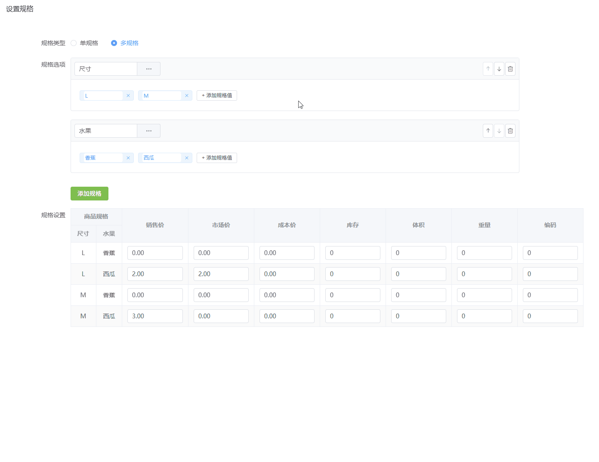
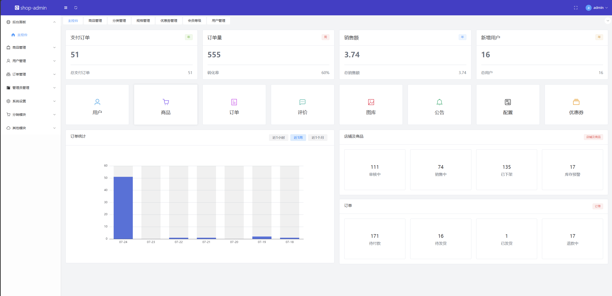
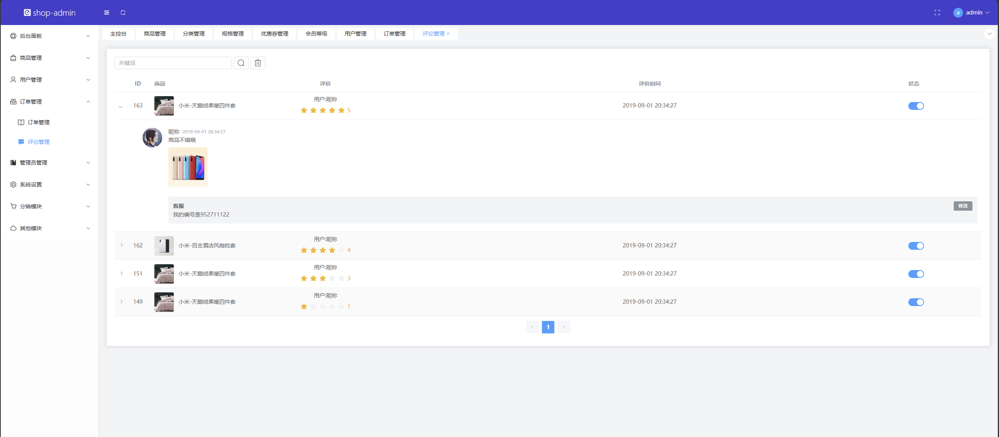
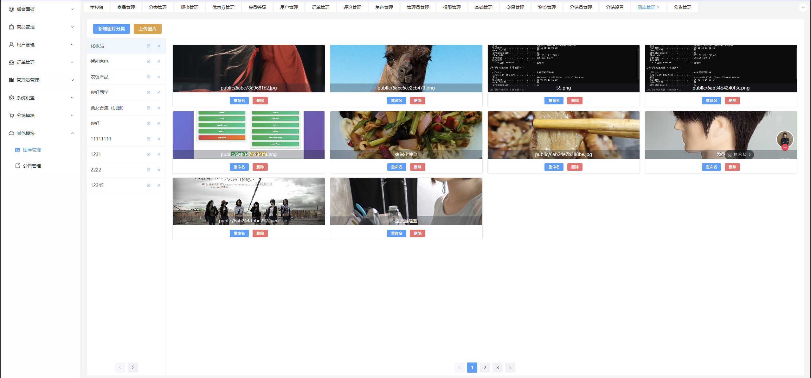

# 商城后台管理系统

<p>
  
  
  
  
  
  
</p>

基于 **Vue 3 + Vite** 构建的 B 端商城后台管理系统。通过**动态路由**与**自定义指令**实现 RBAC 访问控制，覆盖数据看板、商品多规格 SKU 管理、订单/评论、用户与会员等级、管理员与权限、分销、图库与公告等 **10+ 业务模块**。

> 在线体验：<https://shopadmin.liberorvueproject.beer>　·　源码：<https://github.com/liberor/shop-admin>

## 功能特性

- **数据看板**：ECharts 统计图表、数字滚动动画
- **商品管理**：商品列表、分类管理、**多规格 SKU 管理**、优惠券管理
- **订单与评论**：订单管理、商品评论管理
- **用户与会员**：用户管理、会员等级
- **权限体系**：管理员管理、权限管理、角色管理（**RBAC**）
- **分销**：分销员管理、分销设置
- **系统设置**：基础 / 交易 / 物流设置
- **内容管理**：图库管理、公告管理、富文本编辑

## 技术栈

| 分类 | 技术 |
| --- | --- |
| 框架 | Vue 3（`<script setup>`） |
| 构建 | Vite |
| 路由 | Vue Router（Hash 模式 + 动态路由） |
| 状态管理 | Pinia |
| UI | Element Plus（`unplugin-auto-import` + `unplugin-vue-components` 按需引入） |
| 请求 | Axios（拦截器封装） |
| 样式 | 原子化 CSS（WindiCSS） |
| 图表 / 动画 | ECharts + GSAP |
| 富文本 | TinyMCE |
| 其他 | nprogress、@vueuse/core、universal-cookie |

## 项目截图

SKU 多规格：




后台首页：




评论管理页：




图库管理页：



## 快速开始

### 环境要求

- Node.js >= 18

### 安装与运行

```bash
# 克隆
git clone https://github.com/liberor/shop-admin.git
cd shop-admin

# 安装依赖
npm install

# 启动开发服务（自动打开浏览器）
npm run dev

# 构建生产包
npm run build

# 本地预览生产包
npm run preview
```

### 环境变量

在项目根目录的 `.env.development` / `.env.production` 中配置：

| 变量 | 说明 | 默认值 |
| --- | --- | --- |
| `VITE_APP_BASE_API` | 接口基础路径 | `/api` |

> 开发环境通过 `vite.config.js` 将 `/api` 代理到后端服务（并重写去掉 `/api` 前缀），生产环境由 Nginx 反向代理。

## 目录结构

```
src
├─ api/            # 接口定义（按业务模块拆分）
├─ assets/         # 静态资源
├─ components/     # 通用组件（FormDrawer、TagInput、IconSelect、Editor 等）
├─ composables/    # 组合式函数（useTagList、utils）
├─ directives/     # 自定义指令（v-permission 权限控制）
├─ layouts/        # 布局（admin、FHeader、FMenu、FTagList）
├─ pages/          # 页面（按业务模块分组）
├─ router/         # 路由与动态路由注册、全局守卫
├─ store/          # Pinia stores（useLoginStore、useGoodsSkuStore）
├─ axios.js        # Axios 实例与拦截器
└─ main.js         # 应用入口
```

## 核心实现

- **RBAC 权限体系**：登录后请求用户信息，依据后端返回的菜单权限（`menus`）匹配并动态 `addRoute` 挂载前端路由；按钮级权限通过自定义指令 `v-permission` 判断 `ruleNames`，无权限时移除对应元素。
- **路由守卫**：`beforeEach` 中基于 cookie 中的 `admin-token` 做登录校验，配合 `nprogress` 展示加载进度，动态路由变化时重定向以生效。
- **SKU 多规格联动**：使用**笛卡尔积算法**将多个规格项组合生成 SKU 表，实现规格的增删、排序、修改与表格数据实时联动（`useGoodsSkuStore`）。
- **通用组件抽取**：`FormDrawer`、`TagInput`、`IconSelect`、`ChooseImage`、`ImagePanel`、`Editor` 等在多个业务页面复用，提升开发效率。
- **首屏优化**：路由懒加载 + Element Plus 按需引入，首屏 JS 体积由 **1.4MB 降至 240KB（-83%）**，加载时间由约 **6s 优化至约 2s**。

## 部署

```bash
npm run build   # 产出 dist/
```

将 `dist/` 部署到静态服务器（如 Nginx），并配置 `/api` 反向代理到后端服务即可。

## License

[MIT](./LICENSE) © 2026 liberor
